# Health Intelligence Platform

Nền tảng quản lý y tế thông minh tích hợp AI hỗ trợ chẩn đoán — phục vụ 14 nghiệp vụ cốt lõi: Dashboard, Quản lý Bệnh nhân, Giám sát Realtime, Hồ sơ Điện tử (EHR), AI Chẩn đoán, Lịch hẹn & Hàng đợi, Thuốc & Đơn thuốc, Phân tích & Báo cáo, Cảnh báo & Thông báo, Thiết bị IoT, Knowledge Graph, Tìm kiếm, Lưu trữ Y tế, Bản đồ Dịch tễ.

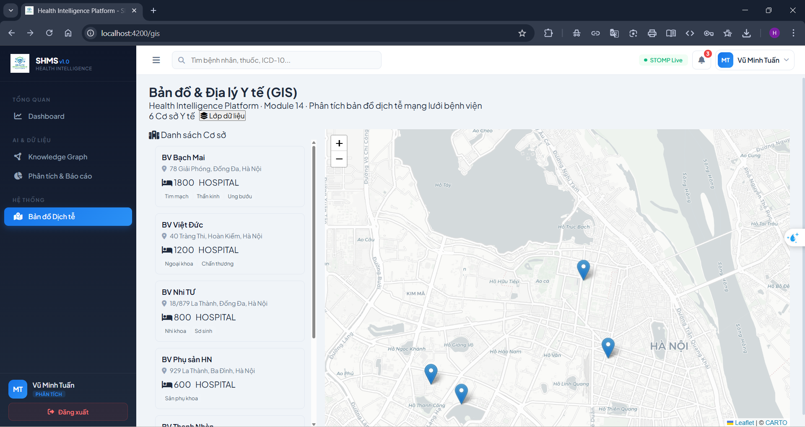
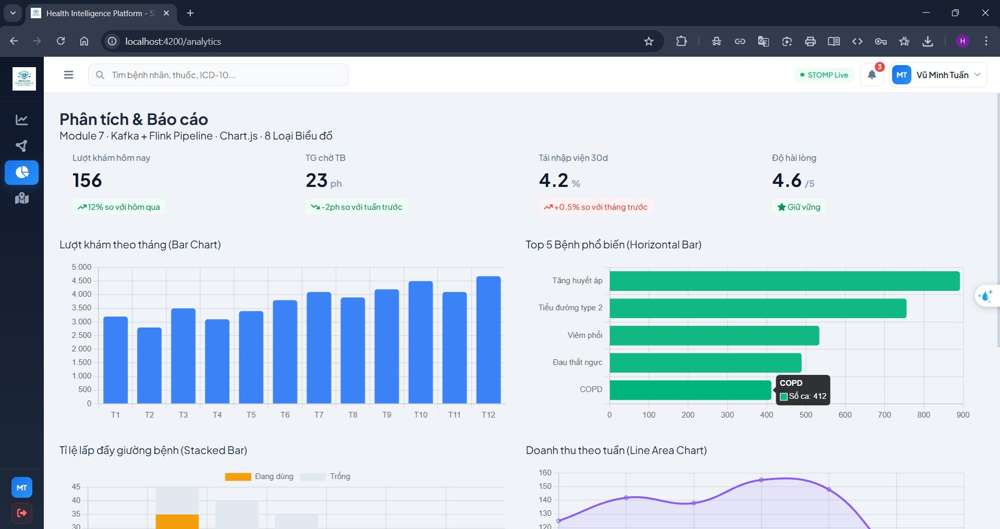
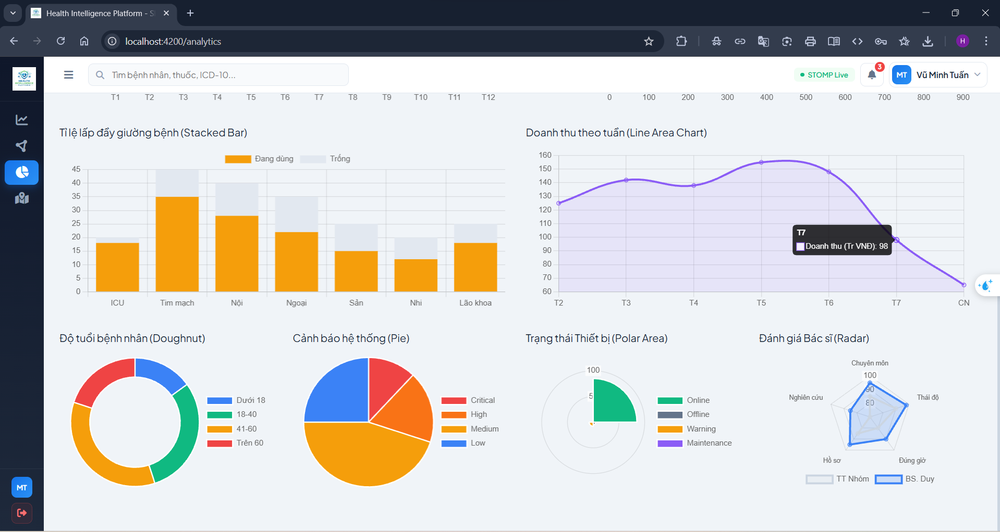
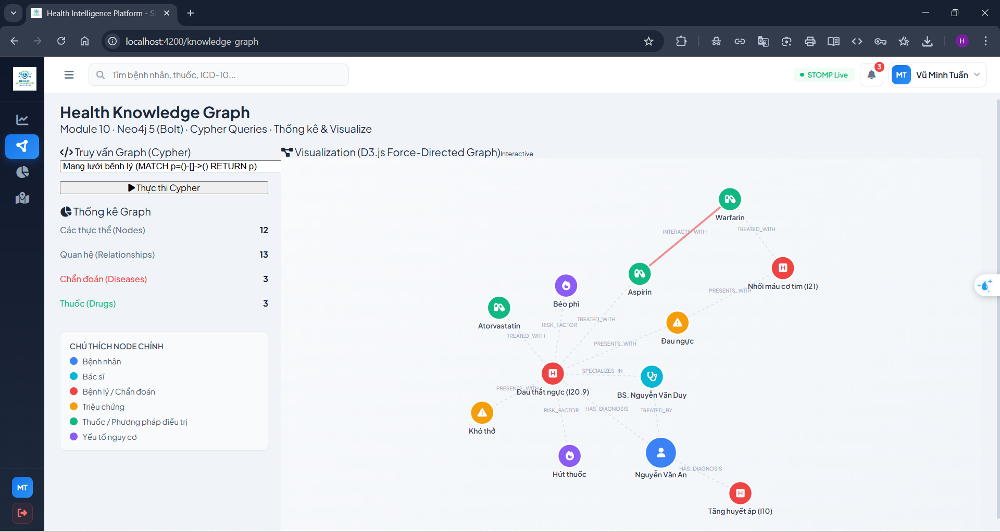
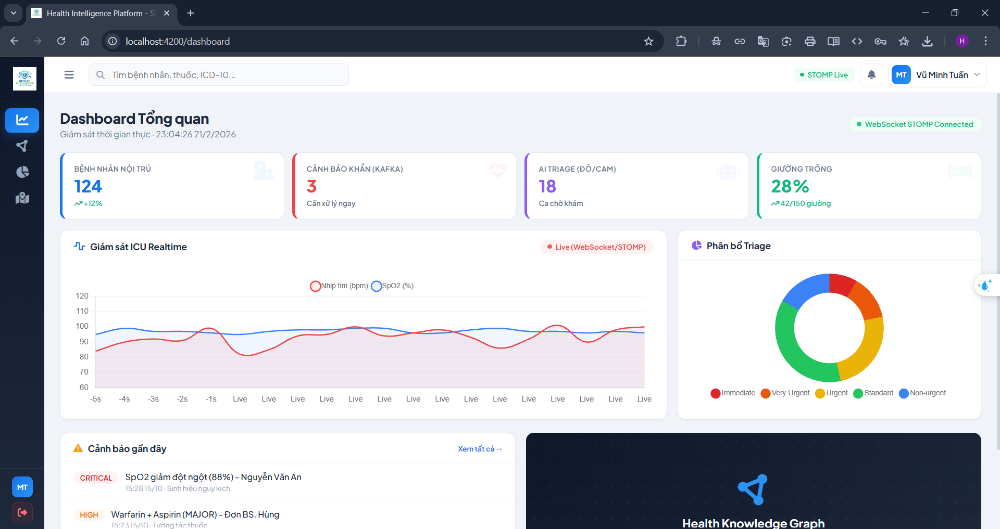
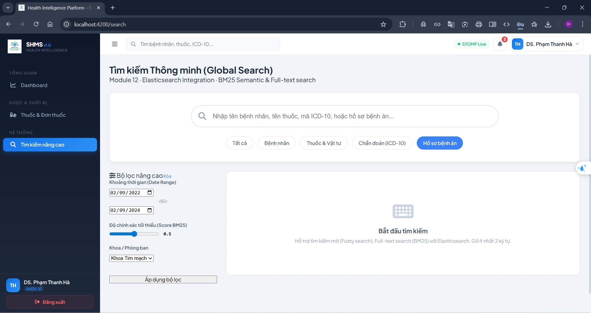
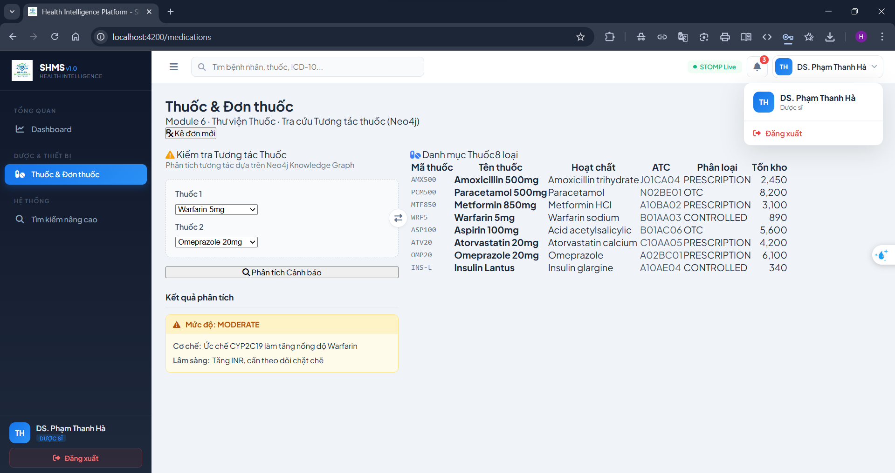
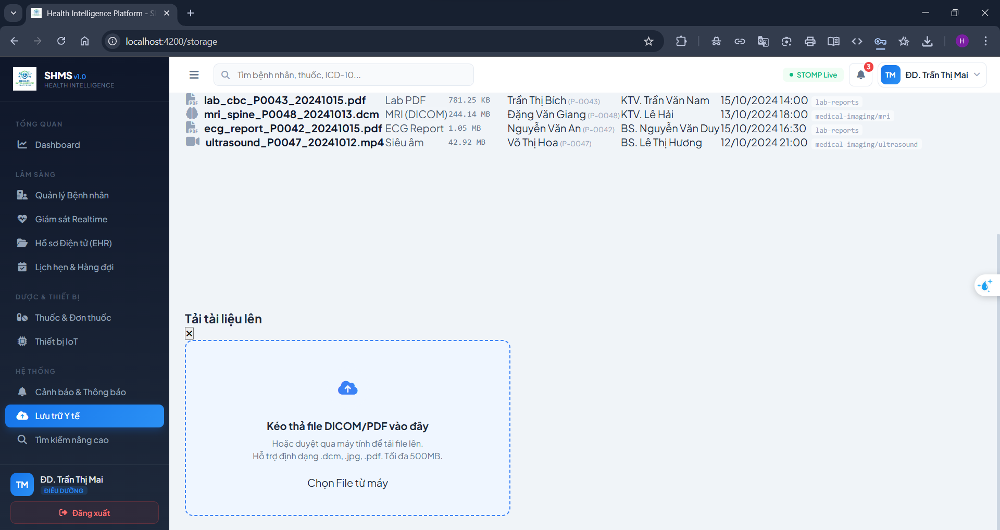
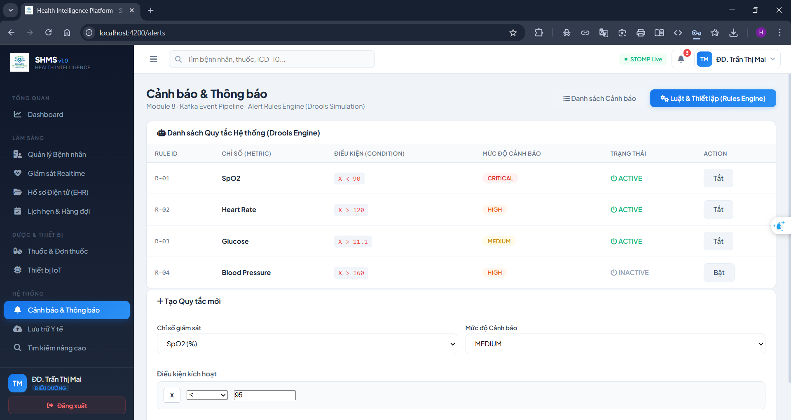
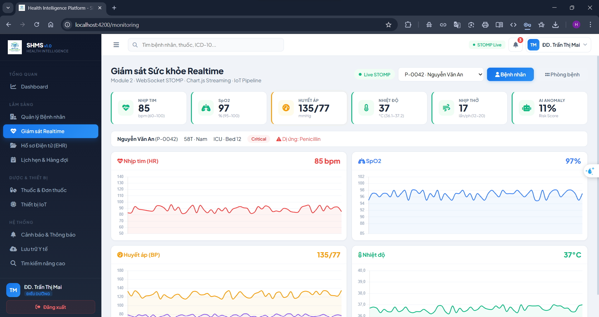
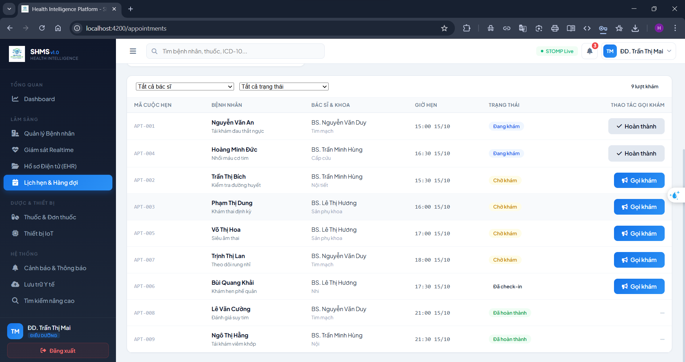
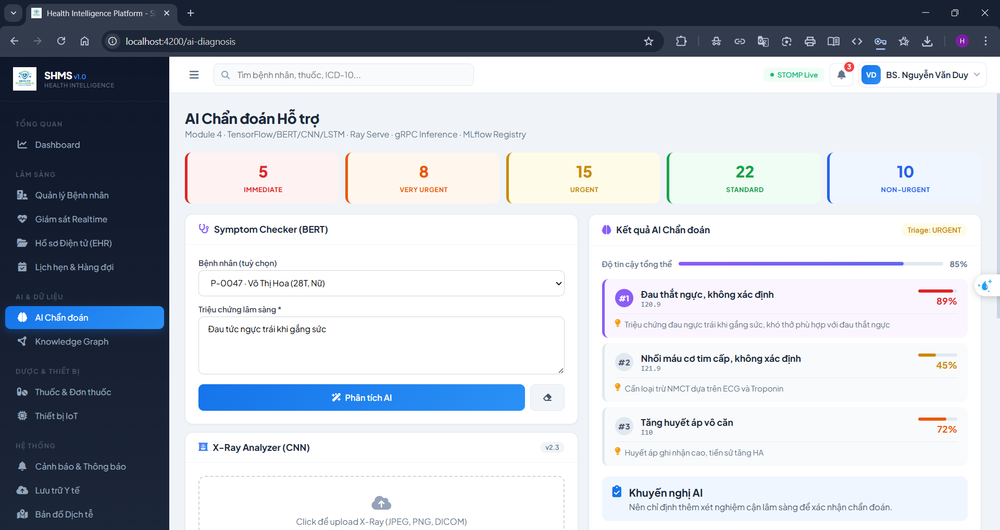

**Frontend** chạy độc lập bằng mock data, sẵn sàng kết nối **17 microservices** backend chỉ bằng 1 dòng config.

```
Tech Stack
├── Frontend:   Angular 17 · Chart.js · D3.js · Leaflet · RxJS · TypeScript · SCSS · Signals
└── Backend:    Java 21 · Spring Boot 3 · Spring Cloud Gateway · Neo4j 5 (Graph DB)
                Apache Kafka · Apache Flink · Redis · Elasticsearch · Ceph
                TensorFlow · MLflow · Ray Serve · Python 3.11
                gRPC · WebSocket (STOMP) · Docker · Kubernetes
```

---

## Tài liệu

```
READ FIRST/              Đọc trước khi làm bất cứ việc gì
├── architecture.md        Kiến trúc 17 microservices, quyết định thiết kế, sơ đồ giao tiếp
├── business-flows.md      8 luồng nghiệp vụ chính với sequence diagram chi tiết
└── rbac-matrix.md         3 lớp phân quyền: UI sidebar · API endpoint · data row/column

READ FRONTEND/           Dành cho frontend developer
├── frontend-structure.md  Cây file Angular 17, mapping TypeScript ↔ Java DTO, 6 tài khoản demo
└── mock-data.md           10 bệnh nhân, 8 thuốc, 8 thiết bị IoT, 5 bệnh viện, seed data khớp backend

READ BACKEND/            Dành cho backend developer
├── backend-structure.md   17 microservices, ports REST + gRPC, package structure chuẩn
├── api-contracts.md       124 endpoints REST, pagination, error format, auth header
├── database-schema.md     PostgreSQL DDL + Neo4j Cypher DDL, constraints, indexes, naming conventions
├── grpc-contracts.md      4 proto files, 10 RPC methods, timeout, circuit breaker config
└── kafka-events.md        13 topics, payload JSON schema, partition strategy, DLQ config

READ DEPLOY/             Dành cho DevOps / người cài đặt
├── docker-compose.md      Toàn bộ hạ tầng 1 file: PostgreSQL + Kafka + Redis + ES + Neo4j + MinIO
├── coding-conventions.md  Quy tắc code Java · Angular · Python · Git, PR checklist
├── testing-guide.md       Pyramid 70/20/5/5, coverage targets, Testcontainers, JaCoCo
├── troubleshooting.md     Debug startup · runtime · distributed tracing · symptom checklist
└── environment-window.md  Cài đặt toàn bộ môi trường trên Windows từ đầu
```

---

## Chạy nhanh (chỉ Frontend)

```bash
cd frontend
npm install
ng serve
```

Mở http://localhost:4200 — đăng nhập bằng username và password.

**6 tài khoản demo:**

| Username | Password | Role | Sidebar hiển thị |
|---|---|---|---|
| `admin` | `admin123` | Quản trị viên | Tất cả 14 modules |
| `doctor` | `doctor123` | Bác sĩ | Lâm sàng + AI + Thuốc + Cảnh báo |
| `nurse` | `nurse123` | Điều dưỡng | Lâm sàng + Thuốc + IoT + Cảnh báo |
| `pharmacist` | `pharma123` | Dược sĩ | Dashboard + Thuốc + Tìm kiếm |
| `patient` | `patient123` | Bệnh nhân | Dashboard + Lịch hẹn |
| `analyst` | `analyst123` | Phân tích dữ liệu | Dashboard + Analytics + GIS + Graph |

---

## Kết nối Backend

Frontend hiện dùng mock data nội bộ. Khi backend sẵn sàng, kết nối bằng cách:

**1. Tạo file `src/environments/environment.ts`:**

```typescript
export const environment = {
  production: false,
  apiBaseUrl: 'http://localhost:8080/api/v1',
  wsEndpoint: 'ws://localhost:8080/ws',
};
```

**2. Sửa `src/app/core/services/api.service.ts` — thay mock bằng HTTP:**

```typescript
// TRƯỚC (mock):
getPatients(): Observable<Patient[]> {
  return of(MOCK_PATIENTS).pipe(delay(300));
}

// SAU (production):
getPatients(): Observable<Patient[]> {
  return this.http.get<Patient[]>(`${environment.apiBaseUrl}/patients`);
}
```

**3. Sửa `src/app/core/services/websocket.service.ts` — thay interval bằng STOMP:**

```typescript
// TRƯỚC (mock):
interval(2000).subscribe(() => { ... });

// SAU (production):
import SockJS from 'sockjs-client';
import { Client } from '@stomp/stompjs';

const client = new Client({
  webSocketFactory: () => new SockJS(environment.wsEndpoint),
  onConnect: () => {
    client.subscribe('/topic/patient/' + patientId + '/vitals', (msg) => {
      this.vitalsSubject.next(JSON.parse(msg.body));
    });
  }
});
client.activate();
```

**4. Sửa `src/app/core/services/auth.service.ts` — thay mock bằng JWT thật:**

```typescript
// TRƯỚC (mock):
login(req: LoginRequest): boolean {
  const entry = MOCK_USERS[req.username];
  ...
}

// SAU (production):
login(req: LoginRequest): Observable<LoginResponse> {
  return this.http.post<LoginResponse>(`${environment.apiBaseUrl}/auth/login`, req).pipe(
    tap(res => {
      localStorage.setItem('shms_token', res.token);
      this.currentUser.set(res.user);
    })
  );
}
```

**`api.interceptor.ts` đã sẵn sàng** gắn `Authorization: Bearer <token>` vào mọi request — không cần sửa.

**Tổng cộng sửa 3 files, tạo 1 file**, toàn bộ 14 modules tự động chuyển sang gọi API thật:

```
src/environments/environment.ts          ← TẠO MỚI (apiBaseUrl + wsEndpoint)
src/app/core/services/api.service.ts     ← SỬA (of(MOCK) → this.http.get)
src/app/core/services/auth.service.ts    ← SỬA (MOCK_USERS → POST /auth/login)
src/app/core/services/websocket.service.ts ← SỬA (interval → SockJS + STOMP)
```

**Mapping đầy đủ Frontend → Gateway → Microservice:**

```
Angular method            → Gateway route              → Service
──────────────            ─ ─────────────              ─ ───────
getPatients()             → GET  /api/v1/patients      → patient-service:8081
getClinicalNotes()        → GET  /api/v1/ehr/notes     → ehr-service:8082
login()                   → POST /api/v1/auth/login    → user-service:8083
getAppointments()         → GET  /api/v1/appointments  → appointment-service:8084
getDrugs()                → GET  /api/v1/drugs         → medication-service:8085
checkDrugInteraction()    → POST /api/v1/drugs/check   → medication-service:8085
getAlerts()               → GET  /api/v1/alerts        → notification-service:8086
getDevices()              → GET  /api/v1/devices       → device-service:8087
runSymptomCheck()         → POST /api/v1/ai/symptom    → ai-gateway:8088 → gRPC → ml-service
search()                  → GET  /api/v1/search        → search-service:8089 → Elasticsearch
getStorageFiles()         → GET  /api/v1/storage       → storage-service:8090 → Ceph S3
getHospitals()            → GET  /api/v1/gis           → gis-service:8091 → PostGIS
getGraphData()            → GET  /api/v1/graph         → graph-service:8092 → Neo4j
subscribeVitals()         → WS   /topic/patient/vitals → Kafka → Flink → WebSocket
```

